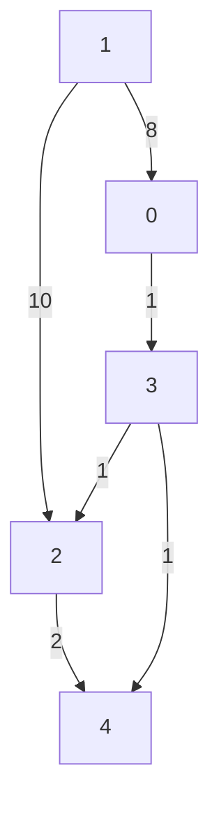
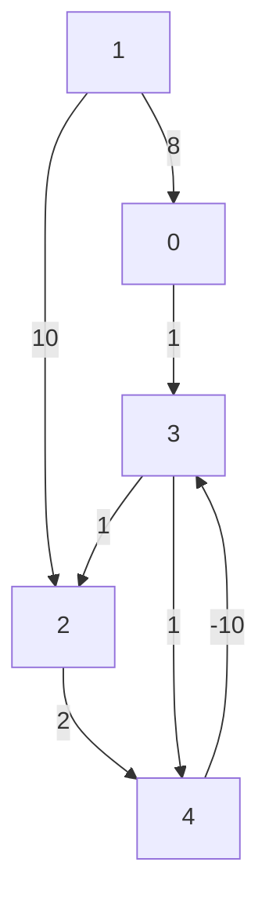

# Bellman-Ford
**Bellman-Ford** algorithm is used to find the shortest path from one vertex to all vertex in a weighted graph.
- Negative edges are allowed but there has to be no negative cycles.

## Graph Representation:


**Bellman-Ford** algorithm utilizes Dynamic Programming.

If we want to find the shortest path between `vertex 1` to other vertices. An array of **V** vertices will be initialzed as follow:

| 0 | 1 | 2 | 3 | 4 |
|---|---|---|---|---|
| ∞ | 0 | ∞ | ∞ | ∞ | 

```python
edges = [
    [0, 3, 1],
    [1, 0, 8],
    [1, 2, 10],
    [2, 4, 2],
    [3, 2, 1],
    [3, 4, 1],
]
```
We iterate all the edges `|V| - 1` times. In this case (`5 - 1 = 4` iterations) of `6` edges. Hence we might perform a maximum of `4 * 6 = 24` iterations. If we find a smaller path, then do an update for the destination vertex.

---

**1st Iteration**

- First edge, `Vertex 0` can go to `Vertex 3`  (`[0, 3, 1]`), but `dist[0] = inf`, hence we skip.

| 0 | 1 | 2 | 3 | 4 |
|---|---|---|---|---|
| ∞ | 0 | ∞ | ∞ | ∞ | 

- Second edge, `Vertex 1` can go to `Vertex 0`  (`[1, 0, 8]`), `dist[1] + 8 = 8`, hence we update `array[0] = 8`.

| 0 | 1 | 2 | 3 | 4 |
|---|---|---|---|---|
| 8 | 0 | ∞ | ∞ | ∞ | 

- Third edge, `Vertex 1` can go to `Vertex 2`  (`[1, 2, 10]`), `dist[1] + 10 = 10`, hence we update `array[2] = 10`.

| 0 | 1 | 2  | 3 | 4 |
|---|---|----|---|---|
| 8 | 0 | 10 | ∞ | ∞ | 

- Forth edge, `Vertex 2` can go to `Vertex 4`  (`[2, 4, 2]`), `dist[2] = 10 + 2 = 12`, hence we update `array[4] = 12`.

| 0 | 1 | 2  | 3 | 4  |
|---|---|----|---|----|
| 8 | 0 | 10 | ∞ | 12 | 

- We skip the fifth and sixth edges `[3, 2, 1], [3, 4, 1]`, because `dist[3] = inf`.

---

**2nd Iteration**

- First edge, `Vertex 0` can go to `Vertex 3`  (`[0, 3, 1]`), `dist[0] = 8 + 1 = 9`, hence we update `array[3] = 9`.

| 0 | 1 | 2  | 3 | 4  |
|---|---|----|---|----|
| 8 | 0 | 10 | 9 | 12 | 

- Second edge, `Vertex 1` can go to `Vertex 0`  (`[1, 0, 8]`), `dist[1] + 8 = 8`, hence we skip because `8` is not smaller than `dist[0] = 8`.

| 0 | 1 | 2  | 3 | 4  |
|---|---|----|---|----|
| 8 | 0 | 10 | 9 | 12 | 

- We skip the Third, Forth and Fifth edges `[1, 2, 10], [2, 4, 2], [3, 2, 1]`, because results are not smaller for the destinations.

- Sixth edge, `Vertex 3` can go to `Vertex 4`  (`[3, 4, 1]`), `dist[3] + 1 = 10`, hence we update `array[4] = 10` because `10 < array[4] = 12`.

| 0 | 1 | 2  | 3 | 4  |
|---|---|----|---|----|
| 8 | 0 | 10 | 9 | 10 | 

---

**3rd Iteration**
- None of the values are changed. Hence we return.

| 0 | 1 | 2  | 3 | 4  |
|---|---|----|---|----|
| 8 | 0 | 10 | 9 | 10 | 

### NOTE:
The **Bellman-Ford algorithm** iterates `|V| - 1` times (where `|V|` is the number of vertices) to ensure that it computes the shortest path from the source vertex to all other vertices correctly. This number of iterations is crucial for the algorithm to guarantee that it has found the shortest paths under the assumption that the graph does not contain any negative weight cycles reachable from the source vertex.

Since the longest possible path without a cycle can be `|V| - 1` edges, the edges must be scanned `|V| - 1` times to ensure the shortest path has been found for all nodes.

Let's consider the below graph where the shortest path from **5** to **0** is **5 -> 4 -> 3 -> 2 -> 1 -> 0** and let's see why repeating for `|V| - 1` loops actually guarantee computing the shortest paths correctly:

**Example:**
**5 -> 4 -> 3 -> 2 -> 1 -> 0**

We will have to keep in mind that we can do edge relaxation in any order. So for the graph above, if we relax the vertex in the order **5 -> 4 -> 3 -> 2 -> 1 -> 0** then we would get the shortest path in the first iteration, and in the subsequent iteration there will be no updation. However, if we scan the vertices in the order **0 -> 1 -> 2 -> 3 -> 4 -> 5**, then it would take 5 iterations `|V| - 1 = 6 - 1 = 5` to actually get the shortest path, because in the first iteration only **01** edge will be relaxed. In second iteration **12** will be relaxed followed by **23** in third iteration, then `34`, `45` accordingly.

```python
# Example Usage (Worst Case)
edges = [
    [0, 1, 3],
    [1, 0, 2],
    [2, 1, 3],
    [3, 2, 1],
    [4, 3, 2],
    [5, 4, 1],
]

g = Graph(edges, 6)

g.bellman_ford(5)
```

## Analyzing Complexity
- **Time:** `O(|V| * |E|)` (Adjacency List)
- **Space:** `O(|V| + |E|)`


## Implementation
```python
def print_solution(dist, V, src):
    print("Vertex Distance from Source")
    for i in range(V):
        print(f"{src} > {i}: {dist[i]}")


class Graph:
    def __init__(self, edges, V):
        self.edges = edges  # List to store all edges in the graph
        self.V = V  # Number of vertices in the graph

    def bellman_ford(self, src):
        # Step 1: Initialize distances from src to all other vertices as INFINITE
        dist = [float('inf')] * self.V
        dist[src] = 0

        # Step 2: Relax all edges |V| - 1 times
        for _ in range(self.V - 1):
            for u, v, w in self.edges:
                if dist[u] != float('inf') and dist[u] + w < dist[v]:
                    dist[v] = dist[u] + w

        # Step 3: Check for negative-weight cycles
        for u, v, w in self.edges:
            if dist[u] != float('inf') and dist[u] + w < dist[v]:
                print("Graph contains negative weight cycle")
                return

        # Print the calculated shortest distances
        print_solution(dist, self.V, src)


# Example usage:
edges = [
    [0, 1, 3],
    [1, 2, 2],
    [2, 3, 1],
    [3, 0, 2],
    [0, 3, 7],
    [1, 0, 8]
]

g = Graph(edges, 4)
g.bellman_ford(1)
```

### Output
```python
Initial distances: [inf, 0, inf, inf, inf]

# 1st iteration
[inf, 0, inf, inf, inf] 0 3 1
[8, 0, inf, inf, inf] 1 0 8
[8, 0, 10, inf, inf] 1 2 10
[8, 0, 10, inf, 12] 2 4 2
[8, 0, 10, inf, 12] 3 2 1
[8, 0, 10, inf, 12] 3 4 1

# 2nd iteration
[8, 0, 10, 9, 12] 0 3 1
[8, 0, 10, 9, 12] 1 0 8
[8, 0, 10, 9, 12] 1 2 10
[8, 0, 10, 9, 12] 2 4 2
[8, 0, 10, 9, 12] 3 2 1
[8, 0, 10, 9, 10] 3 4 1

# 3rd iteration
...

# Vertex Distance from Source
1 > 0: 8
1 > 1: 0
1 > 2: 10
1 > 3: 9
1 > 4: 10
```

## Detecting Negative Cycle


If there is a negative cycle in the graph, the **Bellman-Ford** algorithm will exert all the iterations (No negative cycle will likely end the itertion early if no updates are detected). To deal with negative cycle, we have an additional logic to detect negative cycle.

```python
class Graph:
    ...

    def bellman_ford(self, src):
        ...

        for u, v, w in self.edges:
            if dist[u] != float('inf') and dist[u] + w < dist[v]:
                print("Graph contains negative weight cycle")
                return
        ...

# Example usage:
edges = [
    [0, 3, 1],
    [1, 0, 8],
    [1, 2, 10],
    [2, 4, 2],
    [3, 2, 1],
    [3, 4, 1],
    [4, 3, -10]
]

g = Graph(edges, 5)
g.bellman_ford(1)
```

| 0 | 1 | 2 | 3 | 4 |
|---|---|---|---|---|
| 8 | 0 | -15 | -25 | -15 | 

When the iteration ends, it means we have the shortest path between `Vertex 1` to other vertices. Hence if we find a specific path from `Vertex 1` to a specifc vertex and it is smaller than corresponding shortest path in the distance array, then the negative cycle is detected.

From the iteration code above, at iteration where `u, v, w = 3, 2, 1`. We found a cycle.
- dist[u] + w = `-25 + 1 = -24` (The path is `1 > 3 > 2`)
- dist[v] = `-15`
- `-24 < -15`. We found a new shorter path from (`1 > 2`)
Hence we detected a cycle in this graph.
