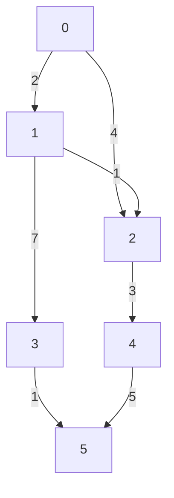

# Dijkstra
**Dijkstra** algorithm is used to find the shortest path from one vertex to all vertex in a weighted graph. **Dijkstra** can work on both weighted and non-weighted graph. On non-weighted graph, edges can be updated to be bidirectional between every pair.
- Negative edges are **not allowed**.

**Dijkstra** algorithm is usually implemented with a Min-Heap. This is because the main idea of Dijkstra's algorithm is to explore the shortest paths first hence a Min-Heap allows the algorithm to always expand the vertex with the smallest tentative distance next. This ensures that the shortest path to each vertex is found in the correct order.

## Graph Representation:


**Dijkstra** algorithm utilizes Greedy Algorithm.

If we want to find the shortest path between `vertex 0` to other vertices. An array of **V** vertices will be initialized as follows:

| 0 | 1 | 2 | 3 | 4 | 5 |
|---|---|---|---|---|---|
| 0 | ∞ | ∞ | ∞ | ∞ | ∞ |

A Heap to track the next Vertex we should visit should also be initialized. We track the shortest distance from the source vertex to a specific vertex in the Min-Heap. 
```python
Heap = [(0, 0)]
```
---

- Starting from source vertex, `Vertex 0` can go to `Vertex 1` and `Vertex 2`. We found a new shorter distance for both connecting vertices. Hence we update.

| 0 | 1 | 2 | 3 | 4 | 5 |
|---|---|---|---|---|---|
| 0 | 2 | 4 | ∞ | ∞ | ∞ |

```python
Heap = [(2, 1), (4, 2)]
```

- Popping the next vertex from the heap, `Vertex 1` can go to `Vertex 2` and `Vertex 3`. We found a new shorter distance connecting `Vertex 2` (from source vertex (`0 -> 1 -> 2 = 3 > 0 -> 2 = 4`)). For `Vertex 3`, We found a new shorter distance connecting `Vertex 4`, Hence we update both.

| 0 | 1 | 2 | 3 | 4 | 5 |
|---|---|---|---|---|---|
| 0 | 2 | 3 | 9 | ∞ | ∞ | 

```python
Heap = [(3, 2), (4, 2), (9, 3)]
```

- Popping the next vertex from the heap, `Vertex 2` can go to `Vertex 4`. We found a new shorter distance connecting `Vertex 4`. Hence, we update.

| 0 | 1 | 2 | 3 | 4 | 5 |
|---|---|---|---|---|---|
| 0 | 2 | 3 | 9 | 6 | ∞ |

```python
Heap = [(4, 2), (9, 3), (6, 4)]
```

- Popping the next vertex from the heap, `Vertex 2` can go to `Vertex 4`. We found a stale shortest path here at path `0 -> 2 = 4`, shortest path is `3` for path `0 -> 1 -> 2`

| 0 | 1 | 2 | 3 | 4 | 5 |
|---|---|---|---|---|---|
| 0 | 2 | 3 | 9 | 6 | ∞ |

```python
Heap = [(6, 4), (9, 3)]
```

- Popping the next vertex from the heap, `Vertex 4` can go to `Vertex 5`. We found a new shorter distance connecting `Vertex 5`. Hence, we update.

| 0 | 1 | 2 | 3 | 4 | 5  |
|---|---|---|---|---|----|
| 0 | 2 | 3 | 9 | 6 | 11 |

```python
Heap = [(9, 3), (11, 5)]
```

- Popping the next vertex from the heap, `Vertex 3` can go to `Vertex 5`. We found a new shorter distance connecting `Vertex 5`. Hence we update.

| 0 | 1 | 2 | 3 | 4 | 5  |
|---|---|---|---|---|----|
| 0 | 2 | 3 | 9 | 6 | 10 |

```python
Heap = [(10, 5), (11, 5)]
```

- The last 2 items in the heap belongs to `Vertex 5`, this vertex doesn't have any outdegrees. So eventually they will be popped from the heap one by one. And return the final answer array.

| 0 | 1 | 2 | 3 | 4 | 5 |
|---|---|---|---|---|---|
| 0 | 2 | 3 | 9 | 6 | 10 |

## Analyzing Complexity
- **Time:** `O((|V| + |E| * Log(|E|)` (With Min Heap)
  - Graph Initialization: `|V|`
  - Insertion and Update: `|E| * Log(|E|)`
    - In the worst case, for each edge, there could be an insertion into the heap because each edge represents a potential path that could lead to a new shortest path update for a neighboring vertex.
    - The total number of insertions can be as large as `|E|` (if each edge leads to an update) plus the initial insertion of each vertex, which gives us a total of up to: `|E| * Log(|E|)`
  - Heap: `O(Log(|E|)`
    - Popping elements from Heap: `O(Log|E|)` (There are at most `|E|` vertices in the heap at any given time)
- **Space:** `O(|V| + |E|)` (Adjacency List)

- **Time:** `O((|V| + |E|) * Log(|V|)` (With Fibonacci Heap)

## Some Characteristics of Dijkstra
- Once a node is popped out of the heap, that means we have found the shortest distance to that node. The remainder of that node in the heap are stale.
  - This is because we always greedily choose the minimum distance to a node from the heap to process, hence the first occurrence of a node would always be the shortest distance to that node.

## Implementation
```python
from heapq import heappop, heappush
from math import inf
from collections import defaultdict


class Graph:
    def __init__(self, size):
        self.size = size
        self.graph = defaultdict(dict)

    def addEdge(self, from_node, to_node, weight):
        self.graph[from_node][to_node] = weight

    def dijkstra(self, src):
        dist = [inf] * self.size
        dist[src] = 0
        heap = [(0, src)]

        while heap:
            curDistance, curV = heappop(heap)

            # Skipping stale value
            if curDistance > dist[curV]:
                continue

            for neighbor, weight in self.graph[curV].items():
                distance = curDistance + weight

                if distance < dist[neighbor]:
                    dist[neighbor] = distance
                    heappush(heap, (distance, neighbor))

        return dist


# Example usage
size = 6
graph = Graph(size)

edges = [
    (0, 1, 2),
    (0, 2, 4),
    (1, 2, 1),
    (1, 3, 7),
    (2, 4, 3),
    (3, 5, 1),
    (4, 5, 5)
]

for fromNode, toNode, weight in edges:
    graph.addEdge(fromNode, toNode, weight)

distances = graph.dijkstra(0)
print(distances)  # [0, 2, 3, 9, 6, 10]
```
