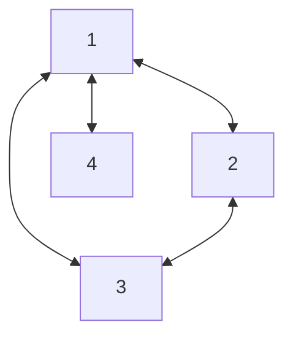
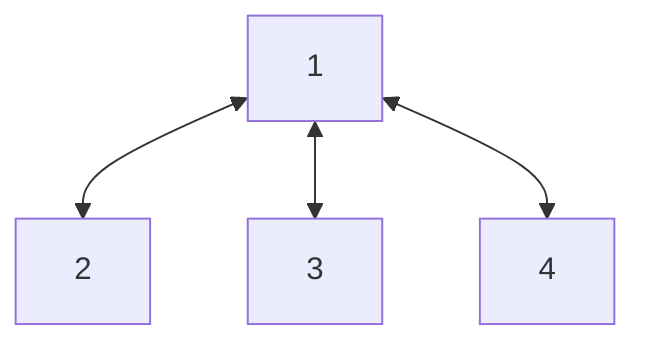
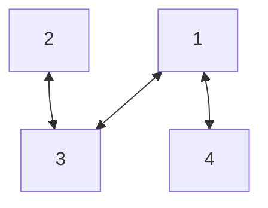
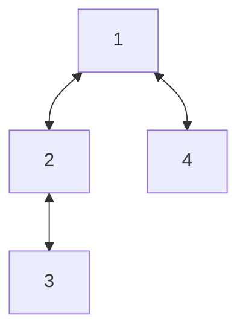
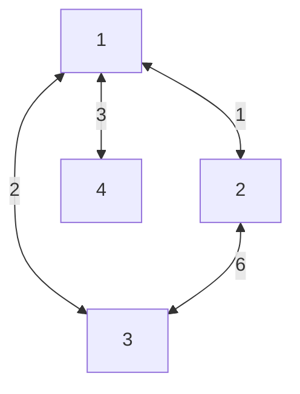
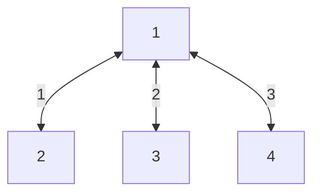

# Kruskal's Minimum Spanning Tree
Kruskal’s algorithm is a greedy algorithm that finds a minimum spanning tree for a connected weighted graph. It finds a subset of the edges that forms a tree that includes every vertex, where the total weight of all the edges in the tree is minimized.
## Spanning Tree
- Given an undirected graph `G = (V, E)`
- A Spanning Tree of `G` is a set of edges:
  - No Cycle
  - Connects all vertices
- A graph can have multiple spanning trees

**Graph G**


**All possible spanning trees for the above graph:**






## Minimum Spanning Tree
A minimum spanning tree (MST) or minimum weight spanning tree for a weighted, connected, undirected graph is a spanning tree with a weight less than or equal to the weight of every other spanning tree.

**Graph G**


**Minimum Spanning Tree**


## Algorithm
1. Sort all the edges in non-decreasing order of their weight.
2. Pick the smallest edge. Check if it forms a cycle with the spanning tree formed so far. If cycle is not formed, include this edge. Else, discard it.
3. Repeat until there are (V-1) edges in the spanning tree.

## Analyzing Complexity
- **Time:** `O(|E|Log(|E|) + |E|)`
- **Space:** `O(|V|)`

## Implementation
```python
class UnionFind:
    def __init__(self, size):
        self.parent = list(range(size))

    def find(self, x):
        if self.parent[x] != x:
            self.parent[x] = self.find(self.parent[x])
        return self.parent[x]

    def union(self, x, y):
        rootX = self.find(x)
        rootY = self.find(y)
        if rootX != rootY:
            self.parent[rootY] = rootX


class KruskalMST:
    def __init__(self, verticesCount, edges):
        self.edges = sorted(edges, key=lambda x: x[2])
        self.nodes = UnionFind(verticesCount)
        self.mst = []

    def getMST(self):
        cost = 0
        for fromVertex, toVertex, weight in self.edges:
            if self.nodes.find(fromVertex) != self.nodes.find(toVertex):
                self.nodes.union(fromVertex, toVertex)
                self.mst.append((fromVertex, toVertex, weight))
                cost += weight
        return self.mst, cost


kruskal = KruskalMST(5, [(0, 1, 10), (0, 2, 6), (0, 3, 5), (1, 3, 15), (2, 3, 4)])
mst, cost = kruskal.getMST()
print("MST:", mst)  # MST: [(2, 3, 4), (0, 3, 5), (0, 1, 10)]
print("Total Cost:", cost)  # Total Cost: 19
```
