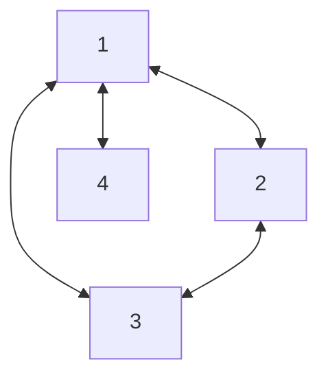
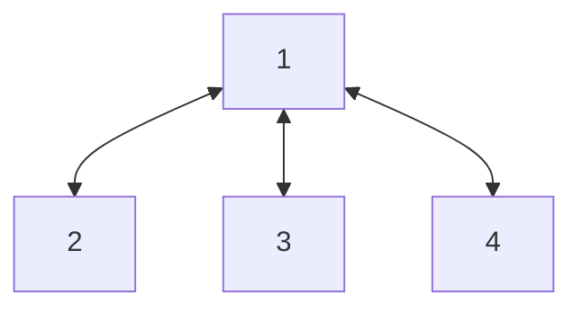
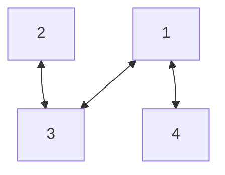
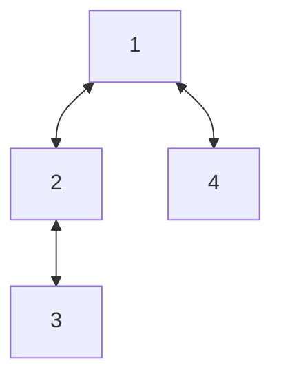
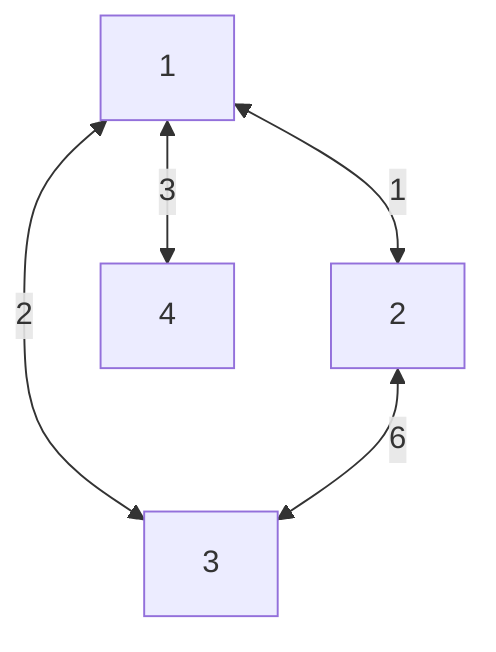
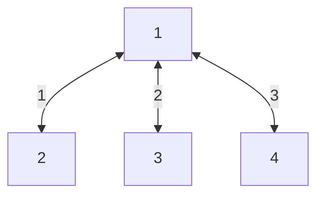

# Kruskal's Minimum Spanning Tree
Kruskal’s algorithm is a greedy algorithm that finds a minimum spanning tree for a connected weighted graph. It finds a subset of the edges that forms a tree that includes every vertex, where the total weight of all the edges in the tree is minimized.
## Spanning Tree
- Given an undirected graph G = (V, E), 
- A Spanning Tree of G is a set of edges:
  - No Cycle
  - Connects all vertices
- A graph can have multiple spanning trees

**Graph G**

**All possible spanning trees for the above graph:**

## Minimum Spanning Tree
A minimum spanning tree (MST) or minimum weight spanning tree for a weighted, connected, undirected graph is a spanning tree with a weight less than or equal to the weight of every other spanning tree.

**Graph G**

**Minimum Spanning Tree**

## Algorithm
1. Sort all the edges in non-decreasing order of their weight.
2. Pick the smallest edge. Check if it forms a cycle with the spanning tree formed so far. If cycle is not formed, include this edge. Else, discard it.
3. Repeat until there are (V-1) edges in the spanning tree.
