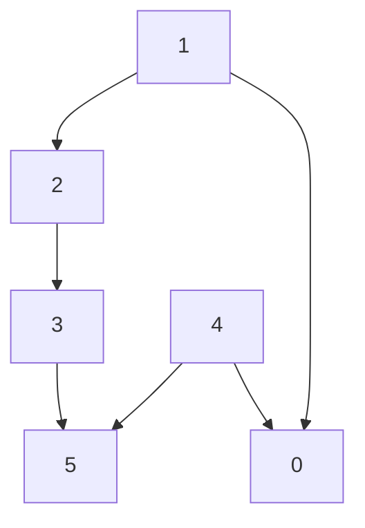

# Topological Sort
Topological Sorting (Toposort) is an algorithm for ordering the vertices of a **directed acyclic graph** (**DAG**) such that:
- For every directed edge ( `u → v` ), vertex ( `u` ) comes before vertex ( `v` ) in the ordering.

**NOTE:** A Directed Acyclic Graph (DAG) cannot have cycles hence the algorithm will not work on graphs that have cycles.

## Analyzing Complexity
- **Time:** `O(|V| + |E|)`
- **Space:** `O(|V|)`

## Graph Representation


## Topological Sort Graph (with DFS)
```python
def toposort(n, edges):
    graph = defaultdict(list)

    for fromNode, toNode in edges:
        graph[fromNode].append(toNode)

    visited = set()
    visitedPath = [False] * n
    res = []

    def toposortUtil(node):
        visited.add(node)
        visitedPath[node] = True

        for childNode in graph.get(node, []):
            if childNode not in visited:
                if toposortUtil(childNode):
                    return True
            elif visitedPath[childNode]:
                return True

        visitedPath[node] = False
        res.append(node)
        return False

    for curNode in graph.keys():
        if curNode not in visited:
            if toposortUtil(curNode):
                return []

    return res[::-1]


# Example usage:
print(toposort(6, [(1, 2), (1, 0), (4, 0), (4, 5), (2, 3), (3, 5)]))
# [4, 1, 0, 2, 3, 5]
```

| Direction | What it means | Valid in `[4, 1, 0, 2, 3, 5]`? |
| :--- | :--- | :--- |
| **1 → 0** | 1 must be before 0 | ✅ **Yes** (1 is 2nd, 0 is 3rd) |
| **4 → 0** | 4 must be before 0 | ✅ **Yes** (4 is 1st, 0 is 3rd) |
| **1 → 2** | 1 must be before 2 | ✅ **Yes** (1 is 2nd, 2 is 4th) |
| **2 → 3** | 2 must be before 3 | ✅ **Yes** (2 is 4th, 3 is 5th) |
| **3 → 5** | 3 must be before 5 | ✅ **Yes** (3 is 5th, 5 is 6th) |
| **4 → 5** | 4 must be before 5 | ✅ **Yes** (4 is 1st, 5 is 6th) |

```python
print(toposort(6, [(1, 2), (1, 0), (4, 0), (4, 5), (2, 3), (3, 5), (5, 1)]))
# [] Has Cycle
```

## Topological Sort Graph (with BFS)
Topological sorting using a **BFS** approach is often referred to as Kahn's Algorithm

```python
from collections import defaultdict, deque

def toposort(n, edges):
    graph = defaultdict(list)
    inDegree = [0] * n

    for fromNode, toNode in edges:
        graph[fromNode].append(toNode)
        inDegree[toNode] += 1

    queue = deque([node for node in range(n) if inDegree[node] == 0])
    res = []

    while queue:
        node = queue.popleft()
        res.append(node)

        for childNode in graph[node]:
            inDegree[childNode] -= 1
            if inDegree[childNode] == 0:
                queue.append(childNode)

    return res if len(res) == n else []


print(toposort(6, [(1, 2), (1, 0), (4, 0), (4, 5), (2, 3), (3, 5)]))
# [1, 4, 2, 0, 3, 5]
print(toposort(6, [(1, 2), (1, 0), (4, 0), (4, 5), (2, 3), (3, 5), (5, 1)]))
# []
```
