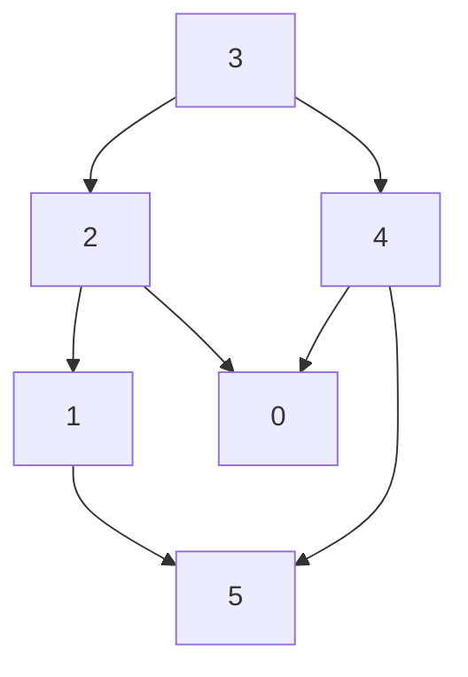

# Topological Sort
Topological Sorting (Toposort) is an algorithm for ordering the vertices of a **directed acyclic graph** (**DAG**) such that:
- For every directed edge ( `u → v` ), vertex ( `u` ) comes before vertex ( `v` ) in the ordering.

## Graph Representation


## Topological Sort Graph (with DFS)
```python
from collections import defaultdict


def toposort(n, edges):
    graph = defaultdict(list)

    for fromNode, toNode in edges:
        graph[fromNode].append(toNode)

    visited = [False] * n
    res = []

    def toposortUtil(node):
        nonlocal curNode

        hasCycle = False
        visited[node] = True
        for childNode in graph.get(node, []):
            if childNode == curNode:
                return True

            if not visited[childNode]:
                hasCycle = hasCycle or toposortUtil(childNode)

        res.append(node)
        return hasCycle

    for curNode in graph.keys():
        if not visited[curNode]:
            if toposortUtil(curNode):
                return []

    return res[::-1]


# Example usage:
print(toposort(6, [(1, 2), (1, 0), (4, 0), (4, 5), (2, 3), (3, 5)]))
# [4, 1, 0, 2, 3, 5]
```

## Topological Sort Graph (with BFS)
Topological sorting using a **BFS** approach is often referred to as Kahn's Algorithm

```python
from collections import defaultdict, deque

def toposort_bfs(n, edges):
    graph = defaultdict(list)
    inDegree = [0] * n

    for fromNode, toNode in edges:
        graph[fromNode].append(toNode)
        inDegree[toNode] += 1

    queue = deque([node for node in range(n) if inDegree[node] == 0])
    res = []

    while queue:
        node = queue.popleft()
        res.append(node)

        for childNode in graph[node]:
            inDegree[childNode] -= 1
            if inDegree[childNode] == 0:
                queue.append(childNode)

    return res if len(res) == n else []


print(toposort_bfs(6, [(1, 2), (1, 0), (4, 0), (4, 5), (2, 3), (3, 5)]))
# [1, 4, 2, 0, 3, 5]
```
