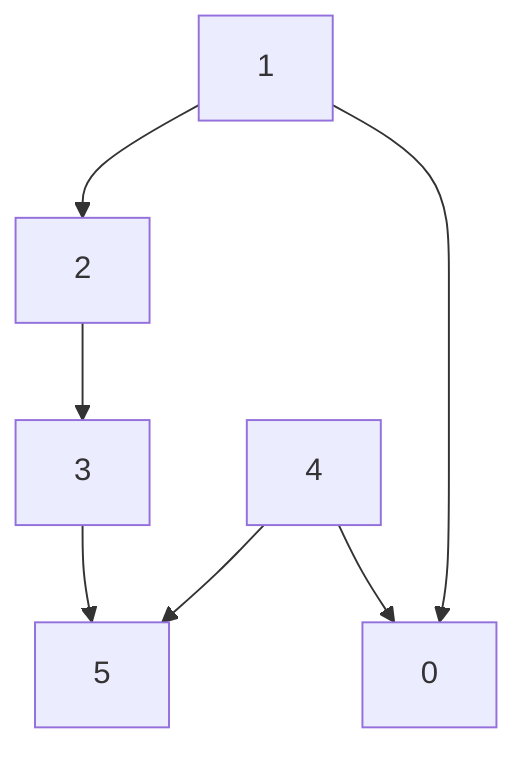

# Topological Sort
Topological Sorting (Toposort) is an algorithm for ordering the vertices of a **directed acyclic graph** (**DAG**) such that:
- For every directed edge ( `u → v` ), vertex ( `u` ) comes before vertex ( `v` ) in the ordering.

**NOTE:** A Directed Acyclic Graph (DAG) cannot have cycles hence the algorithm will not work on graphs that have cycles.

## Analyzing Complexity
- **Time:** `O(|V| + |E|)`
- **Space:** `O(|V|)`

## Graph Representation

```mermaid
graph TD
    1 --> 2
    1 --> 0
    4 --> 0
    4 --> 5
    2 --> 3
    3 --> 5
```

## Topological Sort Graph (with DFS)
```python
def toposort(n, edges):
    graph = defaultdict(list)

    for fromNode, toNode in edges:
        graph[fromNode].append(toNode)

    visited = set()
    visitedPath = [False] * n
    res = []

    def toposortUtil(node):
        visited.add(node)
        visitedPath[node] = True

        for childNode in graph.get(node, []):
            if childNode not in visited:
                if toposortUtil(childNode):
                    return True
            elif visitedPath[childNode]:
                return True

        visitedPath[node] = False
        res.append(node)
        return False

    for curNode in graph.keys():
        if curNode not in visited:
            if toposortUtil(curNode):
                return []

    return res[::-1]


# Example usage:
print(toposort(6, [(1, 2), (1, 0), (4, 0), (4, 5), (2, 3), (3, 5)]))
# [4, 1, 0, 2, 3, 5]
```

| Direction | What it means      | Valid in `[4, 1, 0, 2, 3, 5]`? |
|:----------|:-------------------|:-------------------------------|
| **1 → 0** | 1 must be before 0 | ✅ **Yes** (1 is 2nd, 0 is 3rd) |
| **4 → 0** | 4 must be before 0 | ✅ **Yes** (4 is 1st, 0 is 3rd) |
| **1 → 2** | 1 must be before 2 | ✅ **Yes** (1 is 2nd, 2 is 4th) |
| **2 → 3** | 2 must be before 3 | ✅ **Yes** (2 is 4th, 3 is 5th) |
| **3 → 5** | 3 must be before 5 | ✅ **Yes** (3 is 5th, 5 is 6th) |
| **4 → 5** | 4 must be before 5 | ✅ **Yes** (4 is 1st, 5 is 6th) |

```python
print(toposort(6, [(1, 2), (1, 0), (4, 0), (4, 5), (2, 3), (3, 5), (5, 1)]))
# [] Has Cycle
```

### DFS Underlying Logic and Cycle Detection
1. Run `toposort` on every node.
2. Skip node that has been visited.
3. Append the furthest (then closest) node into the output `res` array. This is handled by recursion.
4. We want to keep visited node `visited` and visited path `visitedPath` separately to handle cycle detection because:
    - Different paths might lead to the same node (`1 --> 0` and `4 --> 0`), hence we don't want to incorrectly detect a cyclic graph when it is not.
    - `visited` usage is to skip reprocessing identical nodes and populate the output `res` array in the correct order. Without this, we must always process nodes that have no indegree nodes to guarantee correct order.
5. Reverse the output `res` array.
    - This is needed since we append the furthest node first then closest. Hence, the reverse guarantees that the closest node would come before the furthest node so that this condition would stay true.
      - For every directed edge ( `u → v` ), vertex ( `u` ) comes before vertex ( `v` ) in the ordering.

**NOTE**: `visitedPath` array is usually used in DFS approach to detect cycle in the DAG. 
The DFS method would still work without the `visitedPath` array, but cycles must not be present else the algorithm would no work.

## Topological Sort Graph (with BFS)
Topological sorting using a **BFS** approach is often referred to as Kahn's Algorithm

```python
from collections import defaultdict, deque

def toposort(n, edges):
    graph = defaultdict(list)
    inDegree = [0] * n

    for fromNode, toNode in edges:
        graph[fromNode].append(toNode)
        inDegree[toNode] += 1

    queue = deque([node for node in range(n) if inDegree[node] == 0])
    res = []

    while queue:
        node = queue.popleft()
        res.append(node)

        for childNode in graph[node]:
            inDegree[childNode] -= 1
            if inDegree[childNode] == 0:
                queue.append(childNode)

    return res if len(res) == n else []


print(toposort(6, [(1, 2), (1, 0), (4, 0), (4, 5), (2, 3), (3, 5)]))
# [1, 4, 2, 0, 3, 5]
print(toposort(4, [(0, 1), (1, 2), (2, 3), (3, 1)]))
# []
```
Building on your analysis of the DFS approach, here is the breakdown of the underlying logic for the BFS-based approach (**Kahn’s Algorithm**).

While DFS relies on the call stack and post-order traversal, BFS uses a dependency-counting mechanism to "peel" the graph layer by layer.

---

### BFS Underlying Logic and Cycle Detection (Kahn's Algorithm)
The core intuition behind Kahn's Algorithm is **indegree management**. The indegree of a node represents the number of incoming edges (dependencies) that must be resolved before that node can be processed.

1. Identify how many incoming edges each node has.
   - Add all nodes with an indegree of `0` to a `queue`. These are the starting points.
2. When a node gets dequeued, Append it to the `res` array.
   - This means that the node has resolved its dependencies.
3. Iterate through its neighbors (children). Decrement the indegree count of each neighbor. 
   - This effectively simulates edge removal from the graph when the node's indegree count becomes `0`.
     - If the neighbor's indegree drops to `0`. Add it to the queue.
4. Detect Cycles. BFS detect cycles when during the decrement operation
   - If the indegree count of a node can never reach `0` then it would never get added to the queue.
   - Resulting in a final `res` output size smaller than the total number of nodes. 

#### Example: `(4, [(0, 1), (1, 2), (2, 3), (3, 1)])`
* **Initial State**: Node 0 starts with an **indegree** of 0, while the cycle nodes (1, 2, and 3) have indegrees of 2, 1, and 1.
* **The "Stuck" Indegree**: After processing node 0, node 1's **indegree** drops from 2 to 1, but it remains stuck there because it is still waiting on node 3.
* **Detection**: Since no other node can reach an **indegree** of 0, the queue becomes empty prematurely, and the final `res` size (1) fails to match the total nodes (4), confirming a cycle.
