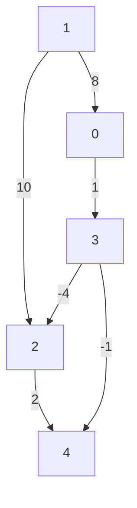

# Bellman-Ford
**Bellman-Ford** is used to find the shortest path from one node to all nodes in a weighted graph.
- Negative edges are allowed but there has to be no negative cycles.

**Example:**

## Graph representation:


**Bellman-Ford** algorithm utilizes Dynamic Programming.

---

If we want to find the shortest path between `vertex 1` to other vertices. An array of **V** vertices will be initialzed as follow:
| 0 | 1 | 2 | 3 | 4 |
|---|---|---|---|---|
| ∞ | 0 | ∞ | ∞ | ∞ | 

```python
edges = [
    [0, 3, 1],
    [1, 0, 8],
    [1, 2, 10],
    [2, 4, 2],
    [3, 2, 1],
    [3, 4, 1],
]
```
We iterate all the edges `n - 1` times. In this case (`5 - 1 = 4` iterations) of `6` edges. Hence we might perform a total of `4 * 6 = 24` iterations
If we find a smaller path, then do an update for the destination vertex.

First edge, `Vertex 0` can go to vertex `3` (`[0, 3, 1]`), but `dist[0] = inf`, hence we skip. 
| 0 | 1 | 2 | 3 | 4 |
|---|---|---|---|---|
| ∞ | 0 | ∞ | ∞ | ∞ | 

Second edge, `Vertex 1` can go to vertex `0` (`[1, 0, 8]`), `dist[1] + 8 = 8`, hence we update `array[0] = 8`. 
| 0 | 1 | 2 | 3 | 4 |
|---|---|---|---|---|
| 8 | 0 | ∞ | ∞ | ∞ | 

Third edge, `Vertex 1` can go to vertex `2` (`[1, 2, 10]`), `dist[1] + 10 = 10`, hence we update `array[2] = 10`. 
| 0 | 1 | 2 | 3 | 4 |
|---|---|---|---|---|
| 8 | 0 | 10 | ∞ | ∞ | 

Forth edge, `Vertex 2` can go to vertex `4` (`[2, 4, 2]`), `dist[2] = 10 + 2 = 12`, hence we update `array[4] = 12`. 
| 0 | 1 | 2 | 3 | 4 |
|---|---|---|---|---|
| 8 | 0 | 10 | ∞ | 12 | 

We skip the fifth and sixth edges `[3, 2, 1], [3, 4, 1]`, because `dist[3] = inf`.

**Next Iteration**
First edge, `Vertex 0` can go to vertex `3` (`[0, 3, 1]`), `dist[0] = 8 + 1 = 9`, hence we update `array[3] = 9`.  
| 0 | 1 | 2 | 3 | 4 |
|---|---|---|---|---|
| 8 | 0 | 10 | 9 | 12 | 

Second edge, `Vertex 1` can go to vertex `0` (`[1, 0, 8]`), `dist[1] + 8 = 8`, hence we skip because `8` is not smaller than `dist[0] = 8` 
| 0 | 1 | 2 | 3 | 4 |
|---|---|---|---|---|
| 8 | 0 | 10 | 9 | 12 | 

We skip the Third, forth and fifth edges `[1, 2, 10], [2, 4, 2], [3, 2, 1]`, because results are not smaller for the destinations.

Sixth edge, `Vertex 3` can go to vertex `4` (`[3, 4, 1]`), `dist[3] + 1 = 10`, hence we update `array[4] = 10` because `10 < array[4] = 12`  
| 0 | 1 | 2 | 3 | 4 |
|---|---|---|---|---|
| 8 | 0 | 10 | 9 | 10 | 


## Implementation
```python
def print_solution(dist, V, src):
    print("Vertex Distance from Source")
    for i in range(V):
        print(f"{src} > {i}: {dist[i]}")


class Graph:
    def __init__(self, edges, V):
        self.edges = edges  # List to store all edges in the graph
        self.V = V  # Number of vertices in the graph

    def bellman_ford(self, src):
        # Step 1: Initialize distances from src to all other vertices as INFINITE
        dist = [float('inf')] * self.V
        dist[src] = 0

        # Step 2: Relax all edges |V| - 1 times
        for _ in range(self.V - 1):
            for u, v, w in self.edges:
                if dist[u] != float('inf') and dist[u] + w < dist[v]:
                    dist[v] = dist[u] + w

        # Step 3: Check for negative-weight cycles
        for u, v, w in self.edges:
            if dist[u] != float('inf') and dist[u] + w < dist[v]:
                print("Graph contains negative weight cycle")
                return

        # Print the calculated shortest distances
        print_solution(dist, self.V, src)


# Example usage:
edges = [
    [0, 1, 3],
    [1, 2, 2],
    [2, 3, 1],
    [3, 0, 2],
    [0, 3, 7],
    [1, 0, 8]
]

g = Graph(edges, 4)
g.bellman_ford(1)
```
