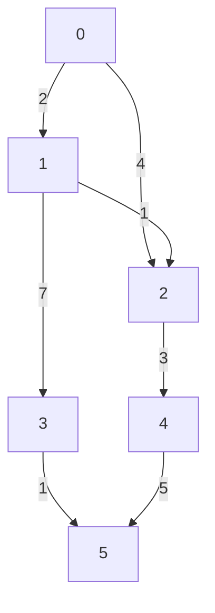

# Dijkstra
**Dijkstra** algorithm is used to find the shortest path from one vertex to all vertex in a weighted graph. **Dijkstra** can work on both weighted and non-weighted graph. On non-weighted graph, edges can be updated to be bidirectional between every pair.
- Negative edges are **not allowed**.

**Example:**

## Graph representation:


**Dijkstra** algorithm utilizes Gready Algorithm.

If we want to find the shortest path between `vertex 0` to other vertices. An array of **V** vertices will be initialzed as follow:
| 0 | 1 | 2 | 3 | 4 |
|---|---|---|---|---|
| 0 | ∞ | ∞ | ∞ | ∞ | 


## Implementation
```python
import heapq


class Graph:
    def __init__(self, size):
        self.size = size
        self.graph = {i: {} for i in range(size)}

    def add_edge(self, from_node, to_node, weight):
        self.graph[from_node][to_node] = weight

    def dijkstra(self, start):
        dist = [float('inf')] * self.size
        dist[start] = 0
        heap = [(0, start)]

        while heap:
            curDistance, curV = heapq.heappop(heap)

            if curDistance > dist[curV]:
                continue

            for neighbor, weight in self.graph[curV].items():
                distance = curDistance + weight

                if distance < dist[neighbor]:
                    dist[neighbor] = distance
                    heapq.heappush(heap, (distance, neighbor))

        return dist


# Example usage
size = 6
graph = Graph(size)

edges = [
    (0, 1, 2),
    (0, 2, 4),
    (1, 2, 1),
    (1, 3, 7),
    (2, 4, 3),
    (3, 5, 1),
    (4, 5, 5)
]

for from_node, to_node, weight in edges:
    graph.add_edge(from_node, to_node, weight)

distances = graph.dijkstra(0)
print(distances)  # [0, 2, 3, 9, 6, 10]
```
