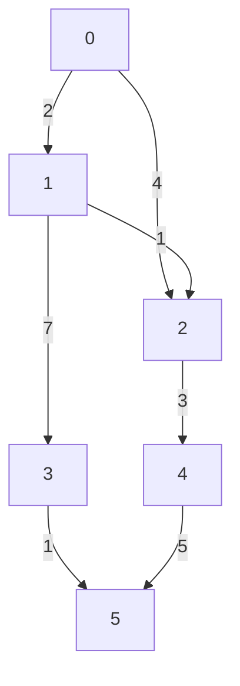

# Dijkstra
**Dijkstra** algorithm is used to find the shortest path from one vertex to all vertex in a weighted graph. **Dijkstra** can work on both weighted and non-weighted graph. On non-weighted graph, edges can be updated to be bidirectional between every pair.
- Negative edges are **not allowed**.

**Example:**

## Graph representation:


**Dijkstra** algorithm utilizes Gready Algorithm.

If we want to find the shortest path between `vertex 0` to other vertices. An array of **V** vertices will be initialzed as follow:
| 0 | 1 | 2 | 3 | 4 |
|---|---|---|---|---|
| 0 | ∞ | ∞ | ∞ | ∞ | 

A Heap to track the next Vertex we should visit should also be initialzed. We track the shortest distance from the source vertex to a specific vertex in the Min-Heap. 
```
Heap = [(0, 0)]
```
---

- Starting from source vertex, `Vertex 0` can go to `Vertex 1` and `Vertex 2`. We found a new shorter distance for both connecting vertices. Hence we update.

| 0 | 1 | 2 | 3 | 4 |
|---|---|---|---|---|
| 0 | 2 | 4 | ∞ | ∞ | 
```
Heap = [(2, 1), (4, 2)]
```

- Popping the next vertex from the heap, `Vertex 1` can go to `Vertex 2`. We found a new shorter distance connecting `Vertex 2` (from source vertex (`0 -> 1 -> 2 = 3 > 0 -> 2 = 4`)). Hence we update.

| 0 | 1 | 2 | 3 | 4 |
|---|---|---|---|---|
| 0 | 2 | 3 | ∞ | ∞ | 

```Heap
Heap = [(3, 2), (4, 2), (9, 3)]
```

- Popping the next vertex from the heap, `Vertex 2` can go to `Vertex 4`. We found a new shorter distance connecting `Vertex 4`. Hence we update.
| 0 | 1 | 2 | 3 | 4 |
|---|---|---|---|---|
| 0 | 2 | 3 | 9 | 6 | 

```Heap
Heap = [(4, 2), (9, 3), (6, 4)]
```

- Popping the next vertex from the heap, `Vertex 2` can go to `Vertex 4`. We found a stale shorest path here at path `0 -> 2 = 4`, shortest path is `3` for path `0 -> 1 -> 2`
| 0 | 1 | 2 | 3 | 4 |
|---|---|---|---|---|
| 0 | 2 | 3 | 9 | ∞ | 

```Heap
Heap = [(6, 4), (9, 3)]
```

- Popping the next vertex from the heap, `Vertex 4` can go to `Vertex 5`. We found a new shorter distance connecting `Vertex 5`. Hence we update.
| 0 | 1 | 2 | 3 | 4 |
|---|---|---|---|---|
| 0 | 2 | 3 | 9 | 11 | 

```Heap
Heap = [(9, 3), (11, 5)]
```

- Popping the next vertex from the heap, `Vertex 3` can go to `Vertex 5`. We found a new shorter distance connecting `Vertex 5`. Hence we update.
| 0 | 1 | 2 | 3 | 4 |
|---|---|---|---|---|
| 0 | 2 | 3 | 9 | 10 | 

```Heap
Heap = [(10, 5), (11, 5)]
```

- The last 2 items in the heap belongs to `Vertex 5`, this vertex doesn't have any outdegrees. So eventually they will be popped from the heap one by one. And return the final answer array.
| 0 | 1 | 2 | 3 | 4 |
|---|---|---|---|---|
| 0 | 2 | 3 | 9 | 10 | 

## Implementation
```python
import heapq


class Graph:
    def __init__(self, size):
        self.size = size
        self.graph = {i: {} for i in range(size)}

    def add_edge(self, from_node, to_node, weight):
        self.graph[from_node][to_node] = weight

    def dijkstra(self, src):
        dist = [float('inf')] * self.size
        dist[src] = 0
        heap = [(0, src)]

        while heap:
            curDistance, curV = heapq.heappop(heap)

            # Skipping stale value
            if curDistance > dist[curV]:
                continue

            for neighbor, weight in self.graph[curV].items():
                distance = curDistance + weight

                if distance < dist[neighbor]:
                    dist[neighbor] = distance
                    heapq.heappush(heap, (distance, neighbor))

        return dist


# Example usage
size = 6
graph = Graph(size)

edges = [
    (0, 1, 2),
    (0, 2, 4),
    (1, 2, 1),
    (1, 3, 7),
    (2, 4, 3),
    (3, 5, 1),
    (4, 5, 5)
]

for from_node, to_node, weight in edges:
    graph.add_edge(from_node, to_node, weight)

distances = graph.dijkstra(0)
print(distances)  # [0, 2, 3, 9, 6, 10]
```
