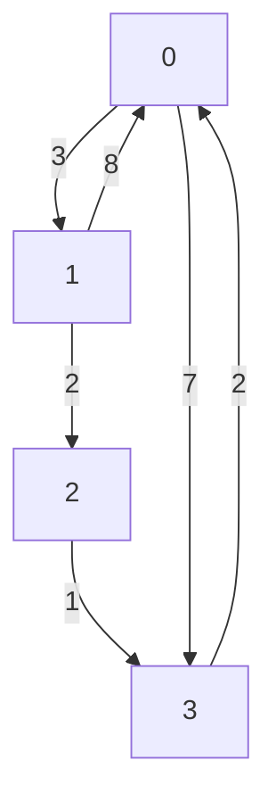

# Floyd-Warshall
**Floyd-Warshall** is used to find the shortest path between all pairs of vertices in a weighted graph.
- Negative edges are allowed but there has to be no negative cycles.

**Example:**

## Graph representation:


## Matrix Representation (Initial):

|   | 0 | 1 | 2 | 3 |
|---|---|---|---|---|
| 0 | 0 | 3 | ∞ | 7 |
| 1 | 8 | 0 | 2 | ∞ |
| 2 | 0 | ∞ | 0 | 1 |
| 3 | 2 | ∞ | ∞ | 0 |

**Floyd-Warshall** algorithms utilizes Dynamic Programming.

The shortest path of every pair of vertices will be calculated by getting the sub-optimal result of the shortest path between every other pairs.
- Shortest path between pair `(3, 2)` will be calculated by getting the optimal result from.
  - pair `(3, 0)` + pair `(0, 2)`
  - pair `(3, 1)` + pair `(1, 2)`
  - pair `(3, 2)` + pair `(2, 2)`
  - pair `(3, 3)` + pair `(3, 2)` (Can be omitted (Same as the third))
- Shortest path between pair `(1, 4)` will be calculated by getting the optimal result from.
  - pair `(0, 0)` + pair `(0, 3)`
  - pair `(0, 1)` + pair `(1, 3)`
  - pair `(0, 2)` + pair `(2, 3)`
  - pair `(0, 3)` + pair `(3, 3)` (Can be omitted (Same as the first))

The shortest path between a pair is updated only when a new minimum result is found.

## Implementation
```python
INF = float('inf')


def floyd_warshall(edges, V):
    # Initialize the adjacency matrix
    dist = [[INF] * V for _ in range(V)]

    # Set the diagonal to 0
    for i in range(V):
        dist[i][i] = 0

    # Fill the adjacency matrix with the given edges
    for u, v, weight in edges:
        dist[u][v] = weight

    # Implementing Floyd-Warshall Algorithm
    for k in range(V):
        for i in range(V):
            for j in range(V):
                if i == k or j == k: 
                    continue
                dist[i][j] = min(dist[i][j], dist[i][k] + dist[k][j])
        print_solution(dist)

    return dist


def print_solution(dist):
    print("Shortest distances between every pair of vertices:")

    # Print the column indices
    print("   ", end="")
    for j in range(len(dist)):
        print(f"{j:4}", end="")
    print()

    # Print the rows
    for i in range(len(dist)):
        # Print the row index
        print(f"{i:2} ", end="")
        for j in range(len(dist[i])):
            if dist[i][j] == INF:
                print(" INF", end="")
            else:
                print(f"{dist[i][j]:4}", end="")
        print()


# Example usage:
edges = [
    [0, 1, 3],
    [1, 2, 2],
    [2, 3, 1],
    [3, 0, 2],
    [0, 3, 7],
    [1, 0, 8]
]

V = 4
distances = floyd_warshall(edges, V)
print_solution(distances)
```

### Output
```python
Shortest distances between every pair of vertices (Initially)
      0   1   2   3
 0    0   3 INF   7
 1    8   0   2 INF
 2  INF INF   0   1
 3    2 INF INF   0

Shortest distances between every pair of vertices after visiting intermediate vertex: 0
      0   1   2   3
 0    0   3 INF   7
 1    8   0   2  15
 2  INF INF   0   1
 3    2   5 INF   0

Shortest distances between every pair of vertices after visiting intermediate vertex: 1
      0   1   2   3
 0    0   3   5   7
 1    8   0   2  15
 2  INF INF   0   1
 3    2   5   7   0

Shortest distances between every pair of vertices after visiting intermediate vertex: 2
      0   1   2   3
 0    0   3   5   6
 1    8   0   2   3
 2  INF INF   0   1
 3    2   5   7   0

Shortest distances between every pair of vertices after visiting intermediate vertex: 3
      0   1   2   3
 0    0   3   5   6
 1    5   0   2   3
 2    3   6   0   1
 3    2   5   7   0
```
